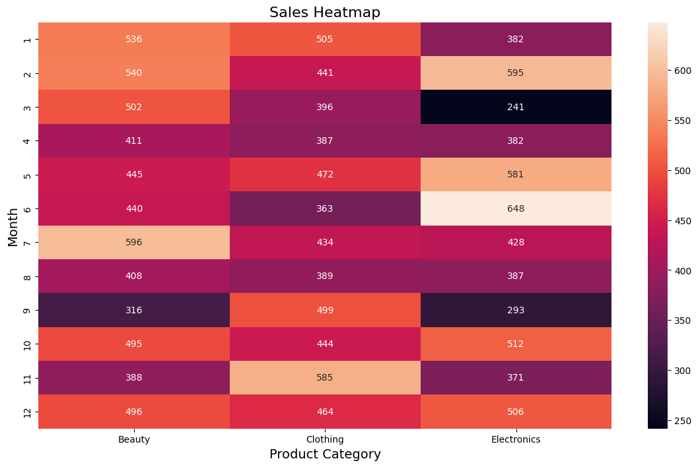

# Retail Sales Data Analysis

## Project Objective

The objective of this project is to analyze retail sales transactions to gain insights into customer behavior, sales trends, and product performance.  
This analysis can help businesses with decision-making in marketing, inventory management, and customer segmentation.

## Data Description

**Source:** Retail Sales Dataset (Kaggle)

The dataset consists of **1,000 retail transactions** with the following columns:
- **Transaction ID** – Unique identifier for each transaction.  
- **Date** – Date of purchase.  
- **Customer ID** – Unique identifier for customers.  
- **Gender** – Gender of the customer (Male/Female).  
- **Age** – Age of the customer.  
- **Product Category** – Product category purchased (e.g., Beauty, Clothing, Electronics).  
- **Quantity** – Number of units purchased.  
- **Price per Unit** – Price of each item.  
- **Total Amount** – Total value of the transaction (Quantity × Price per Unit).

## Libraries Used

- `pandas` → Data manipulation and analysis  
- `numpy` → Numerical computations  
- `matplotlib` & `seaborn` → Data visualization  
- `datetime` → Handling date and time data  

## Data Cleaning

- Ensured "Date" column is in proper datetime format  
- Verified that Total Amount = Quantity × Price per Unit  
- Removed duplicate records (if any)  
- Getting the distribution of sales across product categories  
- Checking for missing values in each column of the dataset  
- Data Uniqueness Check – Counting unique values in each column using `nunique()`

## Feature Engineering

- Created **Month** column from Date  
- Created **Age Group** bins:  
    - 18–24  
    - 25–34  
    - 35–44  
    - 45–54  
    - 55–64  
- Added revenue summaries (Total Amount by Month, Category, Gender)  
- Derived % share of each product category  

## Visualization Insights

### Which gender generates more revenue across product categories?

- Females spend more in Beauty and Clothing categories  
- Males spend more in Electronics  
- Indicates clear gender-based product preference  

### How do total sales trends change over different months?

- Seasonal Trends – Sales peak in Feb, May, July, and Dec, while Sept and April are the lowest.  
- Businesses should align promotions and stock accordingly.  
- Age Group Spending – The 18–24 and 35–44 age groups show the highest variability.  
- Gender Differences – Males in younger groups (18–24, 35–44) tend to spend slightly more.  
- High-Value Customers – Outliers indicate premium buyers contributing disproportionately to revenue.

### How does total spending vary across different age groups, and are there noticeable differences between male and female customers?

- Young Adults (18–24, 25–34) show higher median spending.  
- Males vs Females – Higher box median indicates more spending in that age group.  
- Variation indicates diverse spending behavior.

### What is the distribution of customer ages in the dataset?

- Fairly even distribution across age groups.  
- Concentration around 40–45 and 60+.  
- High engagement in 18–25 group.  
- KDE curve shows good representation across ages.

### What is the gender distribution of customers, and which product categories are most frequently purchased?

- Gender Distribution: Balanced Male and Female representation.  
- Product Category Distribution:  
    - Clothing most purchased.  
    - Electronics second.  
    - Beauty slightly lower.

  

### Which months record the highest and lowest number of transactions?

- Peak: May  
- Consistent in Aug, Oct, Dec  
- Low in Sept

### How does product purchase quantity vary across age groups and product categories?

- Young Adults prefer Beauty & Clothing  
- Middle Age prefers Clothing  
- Older Group prefers Electronics  
- Balanced average (~2.4–2.7 items)

### How does monthly revenue change over time, and are there seasonal trends?

- Peak Revenue: May (₹50,000+)  
- Secondary Peaks: Oct-Dec  
- Low Revenue: March, September  
- Timing promotions during peaks maximizes sales.

### What are the sales insights and market balance across Clothing, Electronics, and Beauty?

- Clothing: 35% of sales  
- Electronics: 34%  
- Beauty: 31%  
- Well-balanced market, no dominant category.

### How does total spending vary across product categories by gender?

- Both genders show similar median spending.  
- Clothing has the lowest spread.  
- Beauty & Electronics show outliers.

### How do sales across categories fluctuate over months?

- Beauty peaks in July  
- Clothing in Nov (festive season)  
- Electronics in June & Feb  
- Sept is weakest.

### Which category generated the highest total revenue and quantity sold?

- Clothing highest revenue & quantity (strong demand).  
- Electronics similar revenue but lower quantity (high-value items).  
- Beauty lowest in both.

### Customer Age Groups, Price Points, and Purchase Patterns

- Fairly uniform across age groups (18–65).  
- Price Bands at ₹50, ₹300, ₹500.  
- Purchases typically 1–4 units.  
- Right-skewed Total Amount: Few high-value purchases.

## Conclusion

- **Seasonal Sales Planning:**  
    Focus on Feb, May, July, Dec for promotions.  
    Boost slow months (Sept, April).

- **Targeted Marketing by Age Group:**  
    18–24 & 35–44 are highly active.  
    Tailored promotions can maximize revenue.

- **Gender-Specific Offers:**  
    Use personalized campaigns to drive engagement.

- **Premium Customer Focus:**  
    Nurture high-value buyers with VIP programs.

- **Cross-Selling Opportunities:**  
    Bundle products to increase basket size.
